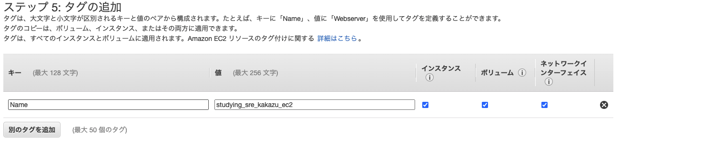

# AWS EC2インスタンス構築のドキュメント

## キーペアを作成する

1. コンソール画面からec2の画面に行く
1. ec2画面左(サイドバー)から**キーペア**を探す


1. 画面右上の「**キーペアを作成**」をクリックし、キーペアを作成する。
    - 名前 :適当な名前を入れる
    - [キーペアのタイプ]
        - RSA, ED25519のどちらかを選択する
        - RSAよりED25519のほうがより強固で速いが、OpenSSH6.5以降でしかサポートされていない
        - Windowsインスタンス、EC2インスタンスConnect、またはEC2シリアルコンソールではサポートされていない
    - [プライベートキーファイル形式]
        - .pem, .ppkからどちらかを選択する
        - ssh接続を行うためにはOpenSSHに対応している.pemを選ぶ

1. 作成したキーペアを適当なフォルダに保存する
1. chmodコマンドを使用して、アクセス権限を許可する
    - ```chmod 400 key-pair.pem```
    - キーペアに対して書き込むことはなさそう

## セキュリティグループを作成する

1. ec2画面左(サイドバー)から**セキュリティグループ**を探す
1. 画面右上の「**セキュリティグループを作成**」をクリックし、セキュリティグループを作成する。
    - [基本的な詳細]
        - セキュリティグループ名 : 適当な名前
        - 説明 : 適当な説明
        - VPC : デフォルトで用意されているやつか自分で作成したやつ。VPNも指定できる
    - インバウンドルール
        - アクセスを許可したい通信を設定する
        - 設定しなくてもあとから設定できる
    - アウトバウンドルール
        - 送信を許可したい通信を設定する
        - 設定しなくてもあとから設定できる
        - デフォルトで全て許可になっている
    - タグ
        - タグを設定する
        - セキュリティグループ一覧のNameに値を入れたいときにも必要
        - [AWS タグの活用方法と命名ルールを考える](https://dev.classmethod.jp/articles/aws-tagging-basic/)


## EC2インスタンスを起動する

1. ec2画面左(サイドバー)から**インスタンス**を探す
1. 画面右上の「**インスタンスを起動**」をクリックし、インスタンスを作成する。
    1. step1 Amazon マシンイメージ(AMI)
        - 適当なものを選択する
        - 基本的に64ビット(x86)を選択する。intel, AMDのcpuアーキテクチャ。
        - [ARMとx86/x64 (Intel, AMD) のCPU、アーキテクチャの違い](https://urashita.com/archives/12325)
        

    1. step2 インスタンスタイプの選択
        - 適当なものを選択する。ユースケースによって、それぞれ最適化されているので、見極めが必要。
        - [インスタンスタイプ](https://docs.aws.amazon.com/ja_jp/AWSEC2/latest/UserGuide/instance-types.html)
        - [Amazon EC2 インスタンスタイプ](https://aws.amazon.com/jp/ec2/instance-types/)
        
        - インスタンスをすぐにセットアップする場合は**確認と作成**、インスタンスの詳細な設定を行うなら**インスタンスの詳細の設定**を選択する
    1. step3 インスタンスの詳細の設定
        - インスタンス数
            - 作成するインスタンスの数
            - Auto Scalingグループを作成することで、負荷などをみて自動でサーバー台数を増やすこともできる
            - [Amazon EC2 Auto Scaling とは](https://docs.aws.amazon.com/ja_jp/autoscaling/ec2/userguide/what-is-amazon-ec2-auto-scaling.html)
        - 購入のオプション
            - スポットインスタンスのこと
            - 中古のインスタンスを入札して安くで使うイメージ
            - [Spot Instances](https://docs.aws.amazon.com/ja_jp/AWSEC2/latest/UserGuide/using-spot-instances.html)
            - [Amazon EC2編～スポットインスタンスを使ってみよう！～](https://recipe.kc-cloud.jp/archives/321)
            - 基本的にチェックは外していい
        - ネットワーク
            - VPCを設定
            - セキュリティグループに設定したVPCに合わせる
        - サブネット
            - vpcのサブネットが自動で割り当てられる
        - 自動割り当てパブリックIP
            - サブネットの設定しだいで自動で割り当てられる。変更もできる
            - 基本的に**有効**にする
            - 外部からアクセス可能なIPアドレスを自動で割り当てるかどうかの設定
            - 固定IPじゃないっぽい。インスタンスを止めたりしたら変わる感じ
        - ホスト名のタイプ
            - サブネット設定を使用する
        - DNS Hostname
            - [よくわからん。これみて](https://docs.aws.amazon.com/AWSEC2/latest/UserGuide/ec2-instance-naming.html)
        - 配置グループ
            - プレイスメントグループと呼ばれる機能を利用するかどうか
            - チェックは外していい
            - [【AWS】プレイスメントグループを完全に理解する](https://qiita.com/mzmz__02/items/8651f578601f3a567fa0)
        - キャパシティーの予約
            - いつでもインスタンスをできるように予約しておく設定
            - インスタンスを起動するときにそのAZ内でもう無理〜って言われないようにするためのもの
            - AZ変更すれば良かったりするらしい
            - 無し
            - [ Amazon EC2 オンデマンドキャパシティ予約 に対する CloudWatch メトリクスが新規追加されました！](https://dev.classmethod.jp/articles/cloudwatch-metrics-amazon-ec2-on-demand-capacity-reservations/)
        - ドメイン結合ディレクトリ
            - ドメイン参加？のことらしい
            - windowsじゃないとできなそう
            - ディレクトリなし
            - [よくわからん。これみて](https://dev.classmethod.jp/articles/domain_join_directory_try/)
        - IAMロール
            - IAMの設定
            - aws内のサービスに制限をかける場合に使う
        - CPUオプション
            - インスタンスの起動時にCPUのコア数とスレッドの数とかを設定する
            - 基本的に触らない
            - より最適化したい場合に使いそう
        - シャットダウン動作
            - 終了はインスタンスの削除のことっぽい
        - 停止 - 休止動作
            - [よくわからん。これみて](https://docs.aws.amazon.com/AWSEC2/latest/UserGuide/Hibernate.html?icmpid=docs_ec2_console)
        - 終了保護の有効化
            - コンソールで終了(削除)できなくする設定
            - サービスの程度によりそう
            - 終了するときにチェック入るからいらなそう
        - モニタリング
            - Amazon CloudWatch使うかどうか
            - インスタンスの負荷とか色々見れる
            - 追加料金が発生する
            - Grafanaとか他のモニタリングサービス使う場合は必要
        - テナンシー
            - テナント属性のこと
            - インスタンスを起動する物理サーバーを専有するか共有するか
            - 専有にしたら料金が発生する
            - ライセンス問題とかで使う感じ？
            - [起動設定によるインスタンステナンシーの構成](https://docs.aws.amazon.com/ja_jp/autoscaling/ec2/userguide/auto-scaling-dedicated-instances.html)
        - Elastic Inference
            - GPUをつける
            - ディープラーニングとか重めの処理でCPUだけで捌けないときとかに使いそう
            - 追加料金が発生する
        - クレジット仕様
            - 決められた以上にcpu使ったら金とるぞって感じの設定
            - [バーストパフォーマンスインスタンスに関する主要な概念と定義](https://docs.aws.amazon.com/ja_jp/AWSEC2/latest/UserGuide/burstable-credits-baseline-concepts.html)
            - [バーストパフォーマンス(T系)インスタンスの特徴を理解して上手に利用しよう](https://aws.amazon.com/jp/blogs/startup/burstable-performance-instances/)
        - ファイルシステム
            - サーバー間で共有できるファイル機能つきストレージのこと
        - ネットワークインターフェース
            - vpcに対してネットワークインターフェースを追加する
            - インスタンスタイプによって制限がある
            - vpcにはデフォルトで設定されている
            - [よくわからん。これみて](https://docs.aws.amazon.com/AWSEC2/latest/UserGuide/using-eni.html?icmpid=docs_ec2_console)
        - Enclave
            - AWS Nitro Enclavesを使うかどうかの設定
            - よりセキュリティを高めるやつっぽい
        - アクセス可能なメタデータ
            - インスタンスメタデータと呼ばれるインスタンスの情報にアクセスできるようにするかどうか
            - チェック必要そう
        - メタデータのバージョン
            - バージョン(v1, v2)でメタデータの取得に違いあり
            - v2のほうがより強固
            - [EC2インスタンスメタデータサービスv2がリリースされてSSRF脆弱性等への攻撃に対するセキュリティが強化されました！](https://dev.classmethod.jp/articles/ec2-imdsv2-release/)
        - Allow tags in metadata
            - メタデータからインスタンスのタグを取得できるようにするか
            - [Amazon EC2メタデータサービスでインスタンスのタグを取得できるようになりました](https://dev.classmethod.jp/articles/get-instance-tags-via-metadata-service/)
        - ユーザーデータ
            - 起動時にコマンドを実行できる
            - 最初から何かしらのパッケージとか入れることができるっぽい
            - [起動時に Linux インスタンスでコマンドを実行する](https://docs.aws.amazon.com/ja_jp/AWSEC2/latest/UserGuide/user-data.html)
            - [AWS勉強会(補足1)ユーザーデータでEC2作成時の初期設定を行う](https://qiita.com/zaki-lknr/items/197ea366bd4243b78e69)

        

        

    1. step4 ストレージの追加
        ・適当なサイズにする
        ・デフォルトで一つ用意されている
        ・インスタンスにSSD or HDDをつけるイメージ
        - ボリュームタイプ
            - デフォルトでルート
            - 2つ目以降はEBS (Elastic Block Store)
            - あまり気にしないでいい
            - EBSは再起動してもデータは消えない
            - 別料金がかかる
        - デバイス
            - ボリュームのデバイス名
            - [Linux インスタンス上のデバイス名](https://docs.aws.amazon.com/ja_jp/AWSEC2/latest/UserGuide/device_naming.html)
        - スナップショット
            - EBSボリュームのデータをS3にバックアップする機能
            - 別料金がかかる
        - サイズ
            - ボリュームのサイズ
            - 適当なサイズに
        - ボリュームサイズ
            - 基本的にSSDかHDD
            - gp2やgp3、io2などの種類があるが、用途によって使い分ける
            - [Amazon EBS ボリュームの種類](https://docs.aws.amazon.com/ja_jp/AWSEC2/latest/UserGuide/ebs-volume-types.html?icmpid=docs_ec2_console)
        - IOPS
            - 1秒あたりに書き込める回数
            - [I/O の特性とモニタリング](https://docs.aws.amazon.com/ja_jp/AWSEC2/latest/UserGuide/ebs-io-characteristics.html)
        - スループット (MB/秒)
            - 1秒あたりに処理できる量のこと
            - ボリュームタイプによって変更も可。上限も決まっている
            - 無料枠もあるが、別料金がかかる
            - [Amazon EBS ボリュームの種類]を参考
        - 終了時に削除
            - インスタンスとEBSは互いに独立している
            - チェックを入れると、インスタンス削除時にEBSも削除することができる
        - 暗号化
            - ボリュームのデータを暗号化し、より強固にする
            - 暗号化にはKMSキーが必要
        - Shared file systems
            - ファイルシステムを設定する
            - ファイルシステムはインスタンスの設定で作成することができる
            - サーバー間の共有ファイル付きストレージこと

        

    1. step5 タグの追加
        - タグを追加する
        - Nameは追加したほうがいい

        

    1. セキュリティグループの設定
        - セキュリティグループの割り当て
            - 新規か既存かを選ぶ
            - セキュリティグループはインスタンスを作成する前に前もって作っておいたほうがいい
            - 既存のものをコピーして新規で作成することも可能。その場合は新規を選択する

        

    1. 確認
        - これまでの設定にミスが無いかの確認を行う
        - インスタンスを作成してからも内容の変更はできるが、一部できないものもある
    1. 起動
        - 確認が完了し、起動ボタンを押すとキーペアの設定を行う
        - 事前に作成したキーペアを選択する

## インスタンスに接続する

1. ssh接続
    - ターミナルでsshコマンドを実行する
        - プライベートキー(.pem)をローカルに持っていないといけない
            ※.pemファイルに読み取り権限が無いとだめ
        - コマンド
            ```
            ssh -i キーペア.pem ユーザー名@インスタンスのパプリック名
            ```
            - ユーザー名：AMIのデフォルトのユーザー名。Amazon Linux2だと```ec2-user```となる
            - インスタンスのパプリック名：パプリックIPv4 DNS もしくはパプリックIPv4 アドレス
            ※パブリック IPv4 DNSがない場合はvpcのDNSホスト名とDNS解決が有効になっているかの確認をする
            ※もしくは、Elastic IPを設定する

            ## Elastic IPを設定する

            1. ec2画面左(サイドバー)から**Elastic IP**を探す
            1. 画面右上の「**Elastic IPアドレスを割り当てる**」をクリックし、Elastic IPを作成する。
                - ネットワークボーダーグループ
                    - リージョンが入力される
                    - ```ap-northeast-1```東京リージョン
                - パブリック IPv4 アドレスプール
                    - Amazon の IPv4 アドレスプール
                        - 基本的にこれ

            ## インスタンスにElastic IPアドレスを関連づける

            1. 作成したElastic IPアドレスを選択してアクションをクリック
            1. ```Elastic IPアドレスの関連付け```をクリック
            1. Elastic IP アドレスの関連付け
                - リソースタイプ
                    - 関連付けるリソースタイプを選択する
                - インスタンス
                    - 関連付けるインスタンスを選択する
                - プライベート IP アドレス
                    - インスタンス側で設定されているプライベートIPアドレス
                - 再関連付け
                    - Elastic IPアドレスを他のインスタンスに関連付ける際の手間を省くもの
                    - 本来であれば、関連付けているものを解除してから別のインスタンスに関連付けるが、これがあればそのまま関連付けることができる

            - 参考
                - [Elastic IP アドレスの操作](https://docs.aws.amazon.com/ja_jp/AWSEC2/latest/UserGuide/elastic-ip-addresses-eip.html#working-with-eips)
                - [Elastic IPの設定](https://qiita.com/Jerid/items/d5dd3a29ed9a0e374493)

        - 接続する
            - 初回接続時に以下の内容が聞かれるので```yes```と答える
            ```
            The authenticity of host '3.114.132.247 (3.114.132.247)' can't be established.
            ECDSA key fingerprint is SHA256:kQa9f3SbdrK0dNed3e/XkWkIMFLnsOXdVaFIqtoYYRU.
            Are you sure you want to continue connecting (yes/no/[fingerprint])?
            ```
            - yesでフィンガープリントを作成し、次回以降のログイン認証を自動化してくれる
            - ログイン成功
            - 

    - 参考
        - [SSH を使用した Linux インスタンスへの接続](https://docs.aws.amazon.com/ja_jp/AWSEC2/latest/UserGuide/AccessingInstancesLinux.html)

# Tips

## Amazon Linuxインスタンスのサーバー時間を日本時間に設定する

awsのec2インスタンスは作成時のデフォルトのタイムゾーンがUTCになっている。
1. 確認
    1. ssh接続
    2. インスタンス内で```date```コマンドや```timedatectlコマンド```を入力
    ```
    [ec2-user@ip-10-0-0-124 ~]$ date
    2022年  2月  8日 火曜日 03:07:22 UTC

    [ec2-user@ip-10-0-0-124 ~]$ timedatectl
          Local time: 火 2022-02-08 03:15:15 UTC
      Universal time: 火 2022-02-08 03:15:15 UTC
            RTC time: 火 2022-02-08 03:15:16
           Time zone: n/a (UTC, +0000)
         NTP enabled: yes
    NTP synchronized: yes
     RTC in local TZ: no
          DST active: n/a
    ```
    3. タイムゾーン一覧
    ```
    [ec2-user@ip-10-0-0-124 ~]$ timedatectl list-timezones
    Africa/Abidjan
    Africa/Accra
    Africa/Addis_Ababa
    ...

    # 東京を探す
    [ec2-user@ip-10-0-0-124 ~]$ timedatectl list-timezones | grep Tokyo
    Asia/Tokyo
    ```
1. タイムゾーンを変更する
    ```
    sudo timedatectl set-timezone Asia/Tokyo

    # 変更されているか確認
    date
    2022年  2月  8日 火曜日 12:30:18 JST
    ```
- 参考
    - [Amazon Linux での タイムゾーンの変更](https://docs.aws.amazon.com/ja_jp/AWSEC2/latest/UserGuide/set-time.html#change_time_zone)
    - [[AWS] Amazon Linux 2 + 旧版 タイムゾーンを変更](https://agohack.com/amazon-linux-change-timezone/)

## .ssh/configを設定してssh接続を簡単に行う

awsのインスタンスにssh接続を行う際に通常以下のようなコマンドを入力する
```
ssh -i キーペア.pem ユーザー名@インスタンスのパプリック名
```
これをconfigファイルに設定を記述するだけで手軽にssh接続ができるようになる。

### configファイルを作成する

1. .ssh/にconfigファイルを作成する
    - ```touch config```
    - configファイルはsshの鍵が格納される.ssh/に用意する
1. 以下のプロパティにそれぞれ適した内容を記述する
    ```
    Host 任意の接続名
        HostName ホスト名
        User ユーザー名
        Port ポート番号 (記述しない場合はデフォルトで22番となる)
        IdentityFile 鍵のpath(~/.ssh/hoge.pem)
    ```
    - 他にも色々なプロパティがあるが、接続するだけなら上記の内容でいい
    - 参考
        - [~/.ssh/configについて](https://qiita.com/passol78/items/2ad123e39efeb1a5286b)
        - [ssh を config ファイルで管理して快適にする](https://s10i.me/whitenote/post/42)

## セキュリティアップデートを行う

作成したインスタンスに含まれるソフトウェアが最新かどうか。最新でなければ最新にする。

1. screenコマンドで万が一セッションがsshのセッションが切れても大丈夫な状態を用意する
    - 参考
        - [Linux screenコマンド使い方](https://qiita.com/hnishi/items/3190f2901f88e2594a5f)
1. updateの確認
    - ```yum check-update```コマンドでupdateするものがあるか確認できる。なければ終了
1. 同じ状態のec2インスタンのバックアップを用意
    - 実際に動いているサービスの場合とかだと、サービスが止まる恐れがあるかもしれないので
1. updateを行う
    - ```sudo yum update```
1. update後にもうupdate内容が無いか確認
1. インスタンの再起動が必要なものがあったか確認
    - ```needs-restarting```コマンドで再起動が必要なプロセスを一覧表示する
    - **-rオプション**をつけることで、再起動が必要かどうかだけを返してくれる
    - 参考
        - [CentOS7でパッケージ更新時に再起動が必要かを確認する方法（needs-restarting）](https://4thsight.xyz/2808)
1. 再起動が必要なら再起動
    - ```sudo reboot```コマンドで再起動
    - コンソール画面から再起動
    - 参考
        - [インスタンスの再起動](https://docs.aws.amazon.com/ja_jp/AWSEC2/latest/UserGuide/ec2-instance-reboot.html)
        - [EC2のリブートについて](https://qiita.com/miyuki_samitani/items/e10eb11c7b63ba6b1711)
1. サービスに影響がないか確認

- 参考
    - [Amazon Linux インスタンスでのインスタンスソフトウェアの更新](https://docs.aws.amazon.com/ja_jp/AWSEC2/latest/UserGuide/install-updates.html)
    - [AWS EC2 Yum Update まとめ](https://blog.e2info.co.jp/2019/08/16/aws-ec2-yum-update-%E3%81%BE%E3%81%A8%E3%82%81/)