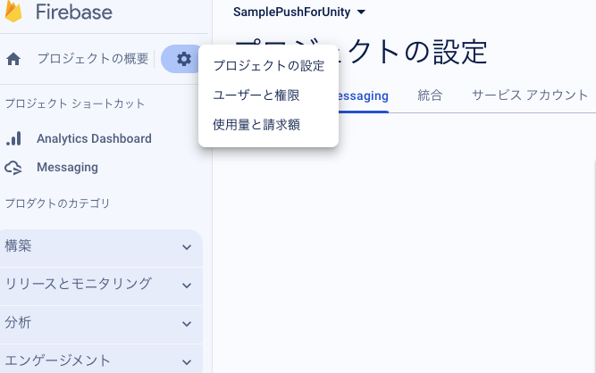

# UnityでFirebaseを利用してPush機能を実装する
- Unity + FirebaseでPushを実装する
- [Unity を使用して Firebase Cloud Messaging クライアント アプリを設定する](https://firebase.google.com/docs/cloud-messaging/unity/client?hl=ja)を参考に実装する

## Firebaseプロジェクトの設定
- プロジェクトを作成する
  - 予めUnityのプロジェクトを作っておく
- 画面のUnityアイコンをクリックする
    
  - アプリの登録
    - `Ios`と`Android`をそれぞれ登録できる
    - `AppleバンドルID`と`Androidパッケージ名`に入力する項目は、ボタン隣の`?`を見ると教えてくれる
      - AppleバンドルID: [Build Settings] > [iOS] > [Player Settings] > [Other Settings] > [Identification] > [Bundle Identifier]
      - Androidパッケージ名: [Build Settings] > [Android] > [Player Settings] > [Other Settings] > [Identification] > [Package Name]
    - 設定ファイルのダウンロード
      - androidは**google-services.json**, iosは**GoogleService-Info.plist**になるのでそれぞれDLし、案内に従いUnityプロジェクトに配置する
        
    - Firebase SDKの追加
      - `Firebase Unity SDK`をDLし解凍する
      - 案内に従いUnityプロジェクトに導入する
        
      - pushには`FirebaseMessaging.unitypackage`が必要

## Firebase Cloud Messagingを初期化する
- プッシュ通知を受け取るためのFirebaseの処理をソースコードに埋め込む必要がある
- 下記コードはFirebaseのドキュメントを多少修正したものになっている
```c#
private void Initialize()
{
  Firebase.FirebaseApp.CheckAndFixDependenciesAsync().ContinueWith(task => {
    var dependencyStatus = task.Result;
    if (dependencyStatus == Firebase.DependencyStatus.Available) {
      // Create and hold a reference to your FirebaseApp,
      // where app is a Firebase.FirebaseApp property of your application class.
        app = Firebase.FirebaseApp.DefaultInstance;

      // Set a flag here to indicate whether Firebase is ready to use by your app.
      Firebase.Messaging.FirebaseMessaging.TokenReceived += OnTokenReceived;
      Firebase.Messaging.FirebaseMessaging.MessageReceived += OnMessageReceived;
    } else {
      UnityEngine.Debug.LogError(System.String.Format(
        "Could not resolve all Firebase dependencies: {0}", dependencyStatus));
      // Firebase Unity SDK is not safe to use here.
    }
  });
}

public void OnTokenReceived(object sender, Firebase.Messaging.TokenReceivedEventArgs token) {
  UnityEngine.Debug.Log("Received Registration Token: " + token.Token);
}

public void OnMessageReceived(object sender, Firebase.Messaging.MessageReceivedEventArgs e) {
  UnityEngine.Debug.Log("Received a new message from: " + e.Message.From);
}
```
- [OnTokenReceivedとOnMessageReceivedについて](https://firebase.google.com/docs/cloud-messaging/unity/client?hl=ja#initialize)

## Android
- Firebase側での設定を上記で完了していれば、Firebase側が用意している処理をソースコードに埋め込むだけ

## ios
- iosはAPNs証明書が必要なので、別途用意する
  - 「p8形式の鍵」と「p12形式の証明書」が存在する
  - 参考：[iOS プッシュ通知の実装に必要な「p12形式の証明書」と「 p8形式の鍵」について](https://qiita.com/kokogento/items/405703f3177ebd2e0320)
  - **今回は「p8形式の鍵」を利用する**
- APNsのp8形式の鍵をFirebaseのiosアプリに登録する
  - Firebaseコンソールからプロジェクトの設定画面に移動する
    
  - ヘッダーの**Cloud Messaging**をクリックし、画面を移動する
  - **Appleアプリの構成**に、登録したAppleアプリがあるので、p8形式の鍵を登録する
    
- xcodeでの設定
  - ユーザー通知フレームワークを追加する
    - xcodeの**General**タブを選択し、**Linked Frameworks and Libraries**を探す(xcodeのバージョンによっては**Frameworks, Libraries, and Embedded Content**になっている)
    - [+]ボタンをクリックし、**UserNotifications.framework**を追加する
  - プッシュ通知を有効にする
    - **Signing & Capabilities**タブを選択し、そのタブの左下にある**Capabilities**をクリックする
    - そこから**Push Notifications**と**Background Modes**を追加する
    - **Background Modes**は**Remote notifications**のチェックボックスにチェックを入れる
- ビルドする

## プッシュ通知のテストを行う
- Firebaseコンソールの左側のサイドバーから**Messaging**をクリックし、プッシュ通知を管理する画面に飛ぶ
- **キャンペーン**タブの画面から**新しいキャンペーンを作成**ボタンをクリックし通知を選ぶ
- この画面でプッシュ通知の設定を行うが、ここで設定した内容を特定のデバイスだけにテストプッシュができる
  
- **テストメッセージを送信**ボタンから特定のデバイスにプッシュする
  - デバイス毎にFCMトークンが発行されるので、それを入力し登録する
  - 登録したデバイスにのみテストプッシュを行うことができる
  
- FCMトークンの取得
  - FCMトークンは**Firebase Cloud Messagingの初期化**で必要な`OnTokenReceived`メソッドの`token.Token`のこと
  - ソースコードでこれをクリップボードか何かでコピーできる処理を追記し利用する
    - 他の方法あったら教えて欲しいです...
