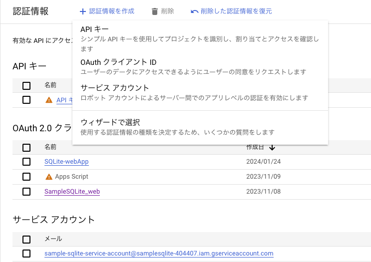
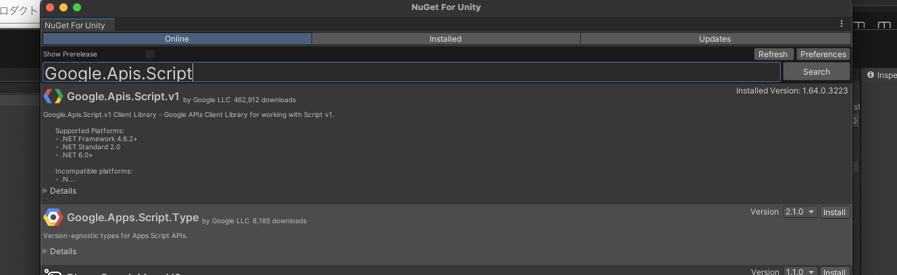

# Unity(C#)からGoogle Apps Scriptを呼ぶ
- **前提条件**
  - GCPプロジェクトが作られている
  - 呼び出すGASが用意されている
  - Unityプロジェクトが作られている
    - Nugetライブラリがインストールされている

## GCP(Google Cloud Platform)からOAuth認証の認証情報を作成する
1. GCP画面左のサイドバーから「認証情報」を選び、画面上部にある「認証情報を作成」から**OAuthクライアントID**を選択
      
2. 「アプリケーションの種類」をデスクトップにし、適当な名前をつけ、作成する
3. 「OAuth2.0クライアントID」の項目に作成した認証情報があることを確認する。
4. 作成時に認証情報が書き込まれたJsonファイルをダウンロードできるのでダウンロードする。(後からでもできる)
   1. 後ほどUnityプロジェクトにjsonファイルを移す

## GCPでApps Script APIを有効にする
1. サイドバーから「有効なAPIとサービス」を選び、GASを利用可能にする**Apps Script API**を検索する
2. 表示されたApps Script APIを有効にする

## UnityからGASを呼ぶ
1. 先ほどDLしたjsonファイルをUnityにコピーする
   1. 今回は**Assets/Editor/** 配下にコピー
2. NugetライブラリからUnityでGASを利用可能にするライブラリをインストールする
      
3. 認証情報を利用して、GASを呼ぶ処理を記述する
```C#
// 認証資格情報を作成する
public static UserCredential GetGoogleCredential()
{
    UserCredential credential;
    var jsonPath = Application.dataPath + "/Editor/" + "~.json";

    using (var stream = new FileStream(jsonPath, FileMode.Open, FileAccess.Read))
    {
        credential = GoogleWebAuthorizationBroker.AuthorizeAsync(
            GoogleClientSecrets.FromStream(stream).Secrets,
            new[] { SheetsService.Scope.Spreadsheets, ScriptService.Scope.ScriptProjects, ScriptService.Scope.ScriptProjectsReadonly },
            "user",
            CancellationToken.None,
            new FileDataStore("token.json", true)).Result;
    }
    return credential;
}
```
```C#
// GASにアクセスできるサービスを作成する
public static void CreateScriptService(UserCredential credential)
{
    s_scriptService = new ScriptService(new BaseClientService.Initializer()
    {
        HttpClientInitializer = credential,
        ApplicationName = s_applicationName,
    });
}
```
```C#
// GASの関数を実行する
public static async Task Exec()
{
    var request = new ExecutionRequest()
    {
        Function = "helloWorld",
        DevMode = true
    };

    var scriptId = "";
    var response = await s_scriptService.Scripts.Run(request, scriptId).ExecuteAsync();

    if (response.Error != null)
    {
        Debug.LogError(response.Error.Message);
        return;
    }
    Debug.Log(response.Response["result"]);
}
```

- gas
```GAS
function helloWorld() {
  let str = "Hello World!!!";
  return str;
}
```

## おまけ
- Unityで用意したクラスをGASに引数で渡す
```C#
// テスト用クラス
public class Info
{
    public string name;
    public string age;
    public Info(string name, string age)
    {
        this.name = name;
        this.age = age;
    }
}

public static async Task Exec()
{
    var info = new Info("test", "20");
    var request = new ExecutionRequest()
    {
        Function = "receivedClass",
        // 生成したInfoクラスを引数として渡す
        Parameters = new List<object>() { info },
        DevMode = true
    };

    var scriptId = "";// GASのスクリプトID
    var response = await s_scriptService.Scripts.Run(request, scriptId).ExecuteAsync();

    if (response.Error != null)
    {
        Debug.LogError(response.Error.Message);
        return;
    }
    Debug.Log(response.Response["result"]);
}
```

```
// GAS
function receivedClass(arg1) {
  return arg1.name + " " + arg1.age;
}
```

- **Parameters**に渡すリストの要素分、GASでの引数となる
  - GAS側で引数が2つある場合、Parametersに渡すリストは2つになる