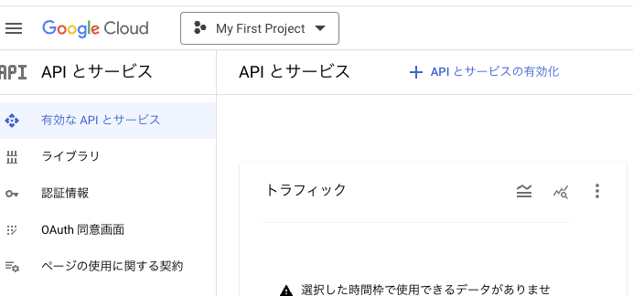
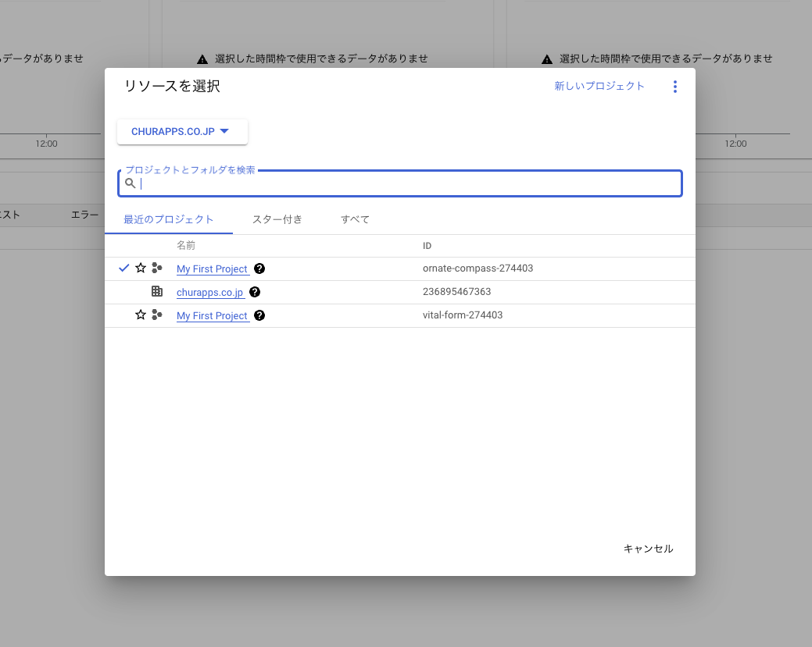
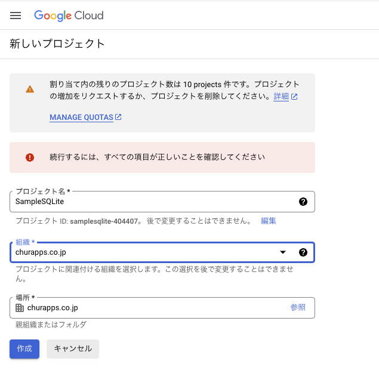
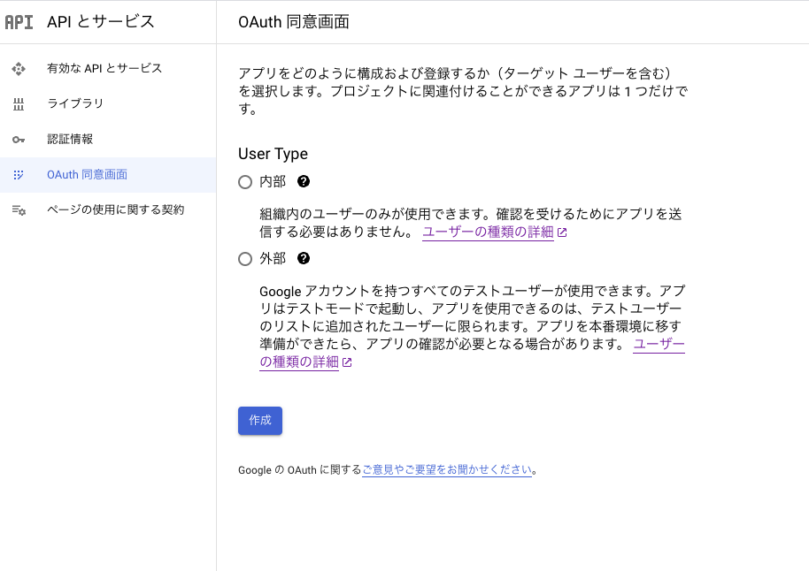
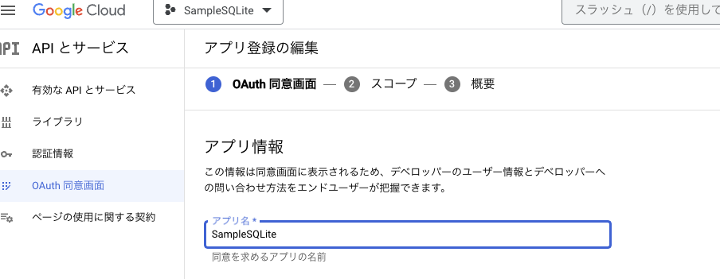
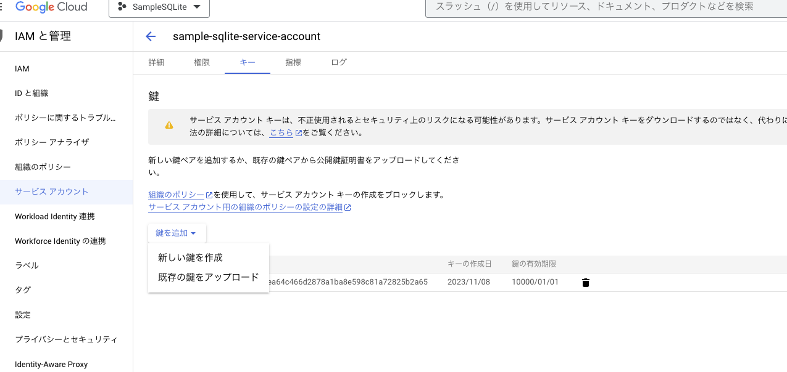
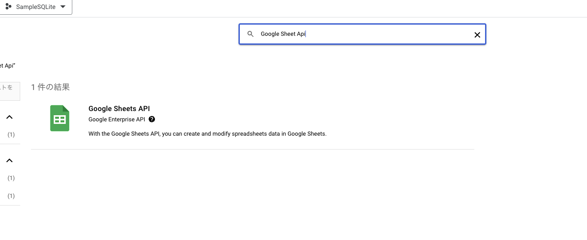

# Unityでスレッドシートに書いてあるマスタをダウンロードする
- SQLiteのDBにマスタデータを入れ込む

## スプレッドシートのデータを取得する方法
- 対象のデータをもつスプレッドシートを作成する
  - Unitテーブル
  - Id, UnitId, Nameのカラムを持つ

### URL知っていれば取れるバージョン
- スプレッドシートを公開する
  - シートの`ファイル`->`共有`->`ウェブに公開`をクリック
  - 公開するシートを`Unit(シート名)`、ウェブページを`カンマ区切り形式(.csv)`に変更
  - URLをコピーする
- Unity側で`UnityWebRequest`を使ってコピーしたURLに対してリクエストを送る
  - `request.SendWebRequest()`を非同期(await)で呼んでいるが、C#のTaskではできない。UniTaskが必要。もしくはコルーチンでできるはず(多分)
    ```C#
    var url = "コピーしたURL";
    var request = UnityWebRequest.Get(url);
    await request.SendWebRequest();
    // デシリアライズは各々で実装
    var dataArray = CSVSerializer.Deserialize<T>(request.downloadHandler.text);
    ```
    ```C#
    // 取得したデータを入れる
    var connection = "SQLite-netのコネクションを取得"
    // 取得したテーブルのデータをまとめて追加
    await connection.InsertAllAsync(dataArray, false);
    ```

### Google Apiを利用して取得
- 参考
  - https://tanuhack.com/operate-spreadsheet/
  - https://techblog.forgevision.com/entry/2023/05/26/120009
#### Unity側
- UnityのPackage Managerを開き、左上にある+ボタンの`Add package from git URL...`をクリック
- このURLを入力
  - `https://github.com/GlitchEnzo/NuGetForUnity.git?path=/src/NuGetForUnity`
  - NugetがUnityで使えるようになる
- UnityのヘッダーにNugetの項目が増えているはずなので、そこから`Manage NuGet Packages`をクリック
- 検索窓に`Google.Apis.Sheets`と入力しSearch
- `Google.Apis.Sheets.v4`が表示されるのでインストールする
- インストールが完了すると`Assets/Packages`ディレクトリが作られ、その中に`Google.Apis.Sheets.v4`と依存関係のある他のライブラリがインストールされていることを確認できる

#### Google側
- GoogleApiを利用するためにはプロジェクトを作る必要がある
  - [Google Cloud Platform](https://console.cloud.google.com/apis/dashboard?project=ornate-compass-274403)
- プロジェクトの作成
  1. 画面上部の`My First Project`を選択
    
  1. 画面右上の`新しいプロジェクト`をクリック
  
  1. 適当なプロジェクト名と組織、場所を入力氏、作成
    
  1. ヘッダーからプロジェクト選択画面で作成したプロジェクトを選択できるようになるので、プロジェクトを切り替える
<!-- - OAuth同意画面でどちらに公開するか設定する。そのまま作成ボタンをクリック
  
- そのまま、適当なアプリ名を入力し、画面下の`保存して次へ`をクリック
  - ※ 他必須項目も適宜入力
     -->
- サービスアカウントを作成する
  - 画面上部の`認証情報を作成`から`サービスアカウント`をクリック
  - 適当なサービスアカウント名を入力し、作成する
  - 作成されたサービスアカウントをクリックし、編集画面に移動する
  - `キー`タブに移動し、鍵を作成する
    
  - Jsonで作成しDLする
- 使用するAPIを有効にする
  - 画面左のサイドバーから`ライブラリ`をクリック
  - そこから使いたいApiを検索し、有効にする
  
- スプレッドシートの設定
  - アクセス制限をかける(デフォルトでなっているはず)
    - スプレッドシート右上の`共有`をクリックし、制限がかかっているか確認
  - `共有`モーダルの`ユーザーやグループを追加`の入力欄に、先ほど作成したサービスアカウントのメールアドレスを入力する

#### 呼び出し処理(Unity)
```C#
public class SpreedSheetManager
{
    private static SheetsService s_sheetService = default;
    private readonly static string s_applicationName = "適当な名前(多分)";
    // 対象スプレッドシートのURLの/d/の後ろ
    // https://docs.google.com/spreadsheets/d/この部分/edit?pli=1#gid=0
    private readonly static string s_spreadsheetId = "スプレッドシートID";

    /// <summary>
    /// シートのマスタを取得する
    /// </summary>
    /// <param name="sheetName">シート名</param>
    /// <returns></returns>
    public static List<string[]> GetSheetData(string sheetName)
    {
        if (s_sheetService == null)
        {
            s_sheetService = OpenSheet();
        }

        ValueRange rVR;
        string wRange;
        wRange = string.Format("{0}", sheetName);
        var getRequest = s_sheetService.Spreadsheets.Values.Get(s_spreadsheetId, wRange);
        rVR = getRequest.Execute();

        var result = new List<string[]>();
        foreach (var list in rVR.Values)
        {
            var stringList = new List<string>();
            foreach (var obj in list)
            {
                stringList.Add((string)obj);
                Debug.Log((string)obj);
            }
            result.Add(stringList.ToArray());
        }
        return result;
    }

    private static SheetsService OpenSheet()
    {
        GoogleCredential credential;
        // サービスアカウントで作成しDLしたjsonファイル
        var keyName = "jsonファイル";

        using (var stream = new FileStream(Application.dataPath + "/Editor/" + keyName, FileMode.Open, FileAccess.Read))
        {
            //CredentialファイルがcredPathに保存される
            credential = GoogleCredential.FromStream(stream).CreateScoped(SheetsService.Scope.Spreadsheets);
        }

        // serviceを作成、Requestパラメータを設定
        var service = new SheetsService(new BaseClientService.Initializer()
        {
            HttpClientInitializer = credential,
            ApplicationName = s_applicationName,
        });
        return service;
    }
}
```