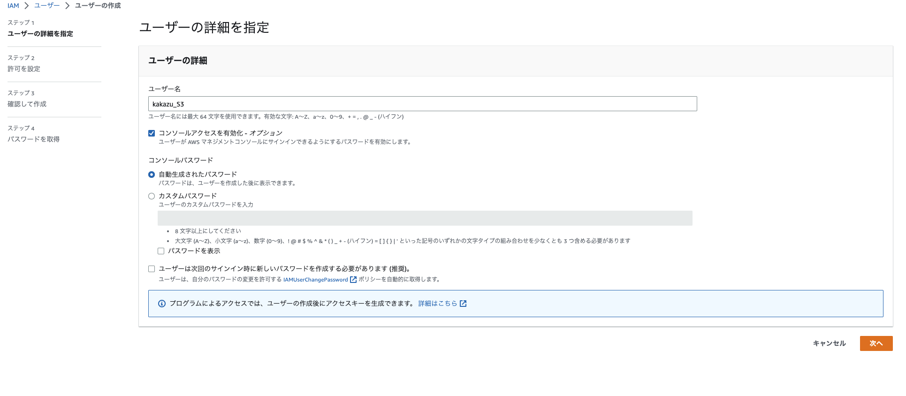
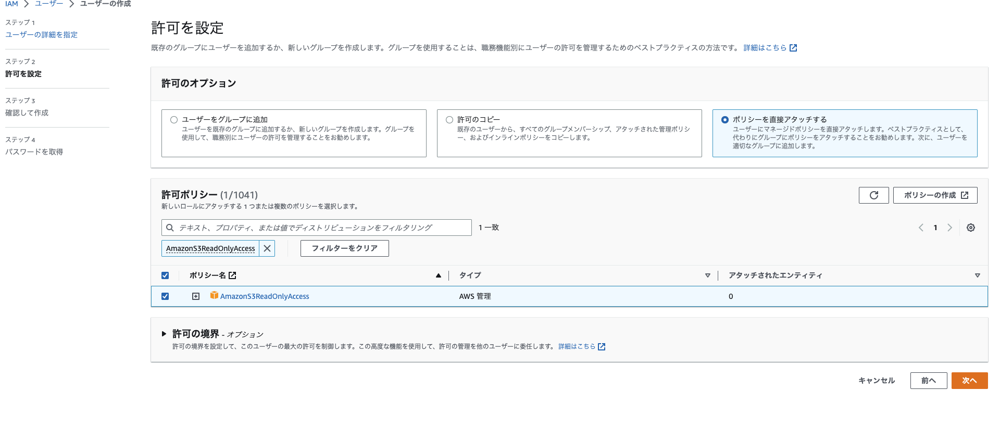
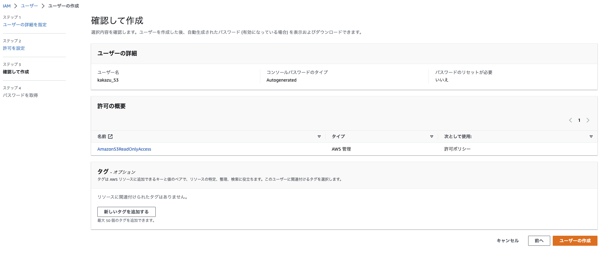
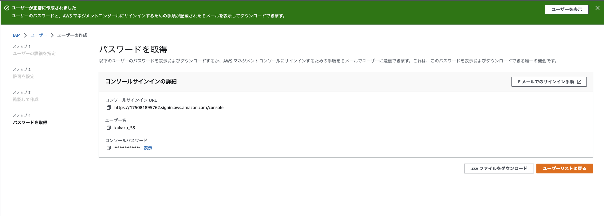
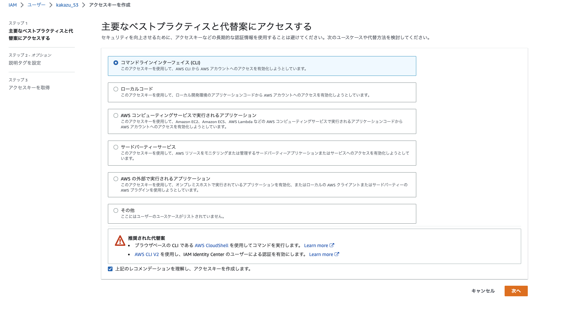
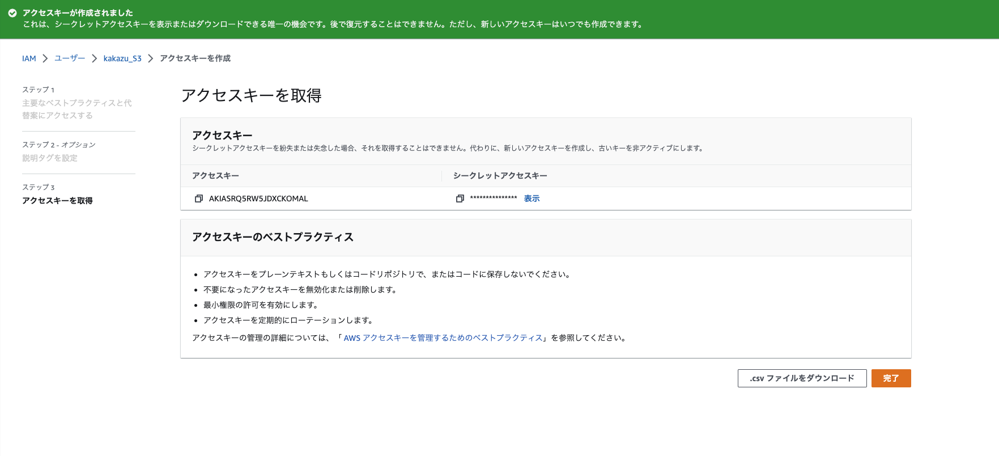

# AWS CLI
AWS CLIについて調べる。
導入からS3の操作についてまとめたい

## インストール
- 参考
  - [AWS CLI のインストールと更新の手順](https://docs.aws.amazon.com/ja_jp/cli/latest/userguide/getting-started-install.html)
  - 確認
    ```
    > which aws
    /usr/local/bin/aws
    > aws --version
    aws-cli/2.9.21 Python/3.9.11 Darwin/21.6.0 exe/x86_64 prompt/off
    ```


## AWS CLIを使用する

### 1. IAMユーザーを作成する
- 参考
  - [AWS CLI バージョン 2 を使用するための前提条件](https://docs.aws.amazon.com/ja_jp/cli/latest/userguide/getting-started-prereqs.html)
  - [普段使いのIAMユーザーを作る - AWSをはじめからていねいに](https://zenn.dev/sway/articles/aws_biginner_create_iam_user)

1. AWSコンソール画面からIAMユーザーを作成する
   1. IAMサービスの画面から、ユーザー画面に移動する
   2. 画面右上の「ユーザーを追加」を選択
   3. ユーザーの作成
      1. ユーザーの詳細を指定
         1. ユーザー名：kakazu_S3
         2. コンソールアクセスを有効化 - オプション：チェック入れる
            1. コンソールパスワード
               1. 自動生成されたパスワード：チェック入れる
               2. ユーザーは次回のサインイン時に新しいパスワードを作成する必要があります (推奨)：チェック外す　(自動生成したパスワードをそのまま使いたいため)
         
      2. 許可を設定
         1. 許可のオプション：ポリシーを直接アタッチする (S3にしかアクセスしないため。他で使い回す予定もないため)
         2. 許可ポリシー：AmazonS3ReadOnlyAccess (S3の読み取りを許可する)
         

      3. 確認して作成
         1. 最終的な設定の確認
         

      4. パスワードを取得
         1. コンソールにログインするためのパスワードを取得する
         


2. アクセスキーを作成する
   1. 作成したIAMユーザーから「セキュリティ認証情報」-> 「アクセスキー」-> 「アクセスキーを作成」を選択
   2. アクセスキーを作成
      1. 主要なベストプラクティスと代替案にアクセスする：コマンドラインインターフェース(CLI)
      2. 説明タグを設定 - オプション
         1. 特に何も行わず「アクセスキーを作成」に進む
         

      3. アクセスキーとシークレットアクセスキーを取得する
         

### 2. AWS CLIの設定をする
- 参考
  - [設定の基本](https://docs.aws.amazon.com/ja_jp/cli/latest/userguide/cli-configure-quickstart.html)
  - [AWS CLIでS3を操作する - AWSをはじめからていねいに](https://zenn.dev/sway/articles/aws_biginner_use_cli)

1. aws configureを使用して設定する
   1. `aws configure`をターミナルで打ち、必要な情報を入力する
        ```
        > aws configure
        AWS Access Key ID [None]: アクセスキー作った時のもの
        AWS Secret Access Key [None]: アクセスキー作った時のもの
        Default region name [None]: ap-northeast-1
        Default output format [None]: json
        ```
   2. AWS S3に接続できるかの確認
        ```
        # バケットの一覧
        > aws s3 ls
        2021-04-19 16:21:24 invoice-report
        2021-04-22 16:24:16 laravel-logs
        ...
        ```
